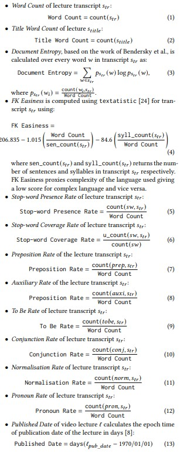
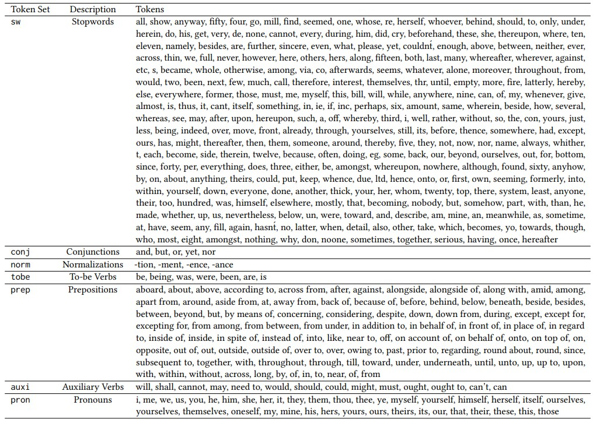

# Video lectures dataset

This repository contains the dataset and source code of the experiments conducted at reported using the VLEngagement 
Dataset. The VLEngagement dataset provides a set of statistics aimed at studying population-based  (context-agnostic) 
engagement in video lectures, together with other conventional metrics in subjective assessment such as average star 
ratings and number of views.  We believe the dataset will serve the community applying AI in Education to further 
understand what are the features of educational material that makes it engaging for learners.

## Use Cases
The dataset is particularly suited to solve the cold-start problem found in educational recommender systems, both when 
i) ***user cold-start***, new users join the system and we may not have enough information about their context so we may
simply recommend population-based engaging lectures for a specific query topic and ii) ***item cold-start***, new 
educational content is released, for which we may not have user engagement data yet and thus an engagement predictive
model would be necessary. To the best of our knowledge, this is the first dataset to tackle such a task in 
education/scientific recommendations at this scale. 

The Dataset is a pivotal milestone in uplifting **sustainability** of future knowledge systems having direct impact on 
scalable, automatic quality assurance [(1)](https://www.k4all.org/wp-content/uploads/2019/08/IJCAI_paper_on_quality.pdf), 
[(2)](https://arxiv.org/pdf/2006.00592.pdf) and personalised education [(3)](https://arxiv.org/pdf/1912.01592.pdf). It 
improves **transparency** by allowing the interpretation of humanly intuitive features and their influence in 
population-based engagement prediction.

## Impact

VLEngagement dataset can be considered as a highly impactful resource contribution to the  information retrieval, 
multimedia analysis, educational data mining, learning analytics and AI in education research community as it will 
enable a whole new line of research that is geared towards next generation information and knowledge management within 
educational repositories, Massively Open Online Course platforms and other  Video/document platforms. This dataset complements the ongoing effort of understanding learner engagement in video lectures 
[(5)](https://doi.org/10.1145/2556325.2566239). However, it dramatically improves the research landscape by formally 
establishing ***two objectively measurable novel tasks*** related to predicting engagement of educational 
videos while making a significantly larger, more-focused dataset and its baselines available to the research community. 
AI in Education, Intelligent Tutoring Systems and Educational Data Mining communities are on a rapid growth trajectory 
right now and will benefit from this dataset as it directly addresses issues related to the respective knowledge fields. 
The simultaneously growing need for scalable, personalised learning solutions makes this dataset a central piece within 
community that will enable improving scalable quality assurance and personalised educational recommendation in the years
 to come. The value of this dataset to the field is expected to last for a long time and will increase with subsequent 
 versions of the dataset being available in the future with more videos and more features.

## Using the Dataset and Its Tools
The resource is developed in a way that any researcher with very basic technological literacy can start building on top 
of this dataset. 
- The dataset is provided in `Comma Seperate Values (CSV)` format making it *human-readable* while being accessible 
through a wide range of data manipulation and statistical software suites. 
- The resource includes 
`helper_tools` ([Found Here](https://github.com/sahanbull/context-agnostic-engagement/tree/master/context_agnostic_engagement/helper_tools))
 that provides a set of functions that any researcher with *basic python knowledge* can use to interact with the dataset 
 and also evaluate the built models.
- `models.regression` ([Found Here](https://github.com/sahanbull/context-agnostic-engagement/tree/master/context_agnostic_engagement/models/regression))
provides *well-documented example code snippets* that can 1) enable the researcher to reproduce results reported for 
baseline models, 2) use an example coding snippets to understand how to build novel models using the VLEngagement dataset.
- `feature_extraction` ([Found Here](https://github.com/sahanbull/context-agnostic-engagement/tree/master/context_agnostic_engagement/feature_extraction))
 module presents the programming logic of how features in the dataset are calculated. The feature extraction logic is 
 presented in the form of *well-documented (PEP-8 standard, Google Docstrings format)* Python functions that can be used
 to 1) understand the logic behind feature extraction or 2) apply the feature extraction logic to your own lecture records
 to generate more data
 
 ## Structure of the Resource

The structure of the repository divides the resources to two distinct components on top-level.
1. `VLEngagement_datasets`: This section stores the different versions of VLEngagement datasets (current version: `v1`)  
2. `contenxt_agnostic_engagement`: This module stores all the code related to manipulating and managing the datasets. 

In addition, there are two files:
- `README.md`: The main source of information for understanding and working with the VLEngagement datasets.
- `setup.py`: Python setup file that will install the support tools to your local python environment. 
 
### Table of Contents
- [VLEngagement Datasets](#vlengagement-datasets)
    - [Anonymity](#anonymity)
    - [Versions](#versions)
    - [Features](#features)
        - [General Features](#general-features)
        - [Content-based Features](#content-based-features)
        - [Wikipedia-based Features](#wikipedia-based-features)
        - [Video-specific Features](#video-specific-features)
    - [Labels](#labels)
        - [Explicit Rating](#explicit-rating)
        - [Popularity](#popularity)
        - [Watch Time/Engagement](#watch-timeengagement)
- [`content_agnostic_engagement` Module](#content_agnostic_engagement-module)
    - [`feature_extraction`](#feature_extraction)
    - [`helper_tools`](#helper_tools)
    - [`models`](#models)
- [References](#references)
        

## VLEngagement Datasets
This section makes the VLEngagement datasets publicly available. The VLEngagement dataset is constructed using the
 aggregated video lectures consumption data coming from a popular OER repository, 
 [VideoLectures.Net](http://videolectures.net/). These videos are recorded when researchers are presenting their work at 
 peer-reviewed conferences. Lectures are reviewed and hence material is controlled for correctness of knowledge and 
 pedagogical robustness. 

### Anonymity
We restrict the final dataset to lectures that have been viewed by at least 5 unique users to preserve anonymity of 
users and have reliable engagement measurements. Additionally, a regime of techniques are used for preserving the
anonymity of the data authors using the remaining features. Rarely occurring values in *Lecture Type* feature were 
grouped together to create the `other` category. *Language* feature is grouped into `en` and `non-en` categories. 
Similarly, Domain category groups Life Sciences, Physics, Technology, Mathematics, Computer Science, Data Science 
and Computers subjects to `stem` category and the other subjects to `misc` category. Rounding is used with 
*Published Date*, rounding to the nearest 10 days. *Lecture Duration* is rounded to the nearest 10 seconds. 
Gaussian white noise (10%) is added to *Title Word Count* feature and rounded to the nearest integer.

### Versions
All the relevant datasets are available as Comma Separated Value (CSV) file within a dataset subdirectory 
(eg. `v1/VLEngagement_dataset_v1.csv`). At present, there are two datasets that are available through this resource. 

| Dataset | Number of Lectures | Number of Users   | Log Recency              | URL |
|---------|--------------------|-------------------|--------------------------|-----|
| v1      | 4046               | Around 150k       | Until  February 17, 2018 | [Link to Dataset](http://videolectures.net/) |
| ***12k***     | 11568              | Over 1.1 Million  | Until February 01, 2021  |  [Link to Dataset](http://videolectures.net/) |

The latest dataset of this collection is `12k`. The tools required to load,
and manipulate the datasets are found in `context_agnostic_engagement.utils.io_utils` module.  

### Features
There 4 main types of features extracted from the video lectures. These features can be categorised into six quality 
verticals [(1)](https://www.k4all.org/wp-content/uploads/2019/08/IJCAI_paper_on_quality.pdf). All the features that are
included in the dataset are summarised in Table 1.

Table 1: Features extracted and available in the VLEngagement dataset with their variable type (Continuous vs. 
Categorical) and their quality vertical.

<table class="tg">
<thead>
  <tr>
    <th class="tg-fymr">Variable Type</th>
    <th class="tg-fymr">Name</th>
    <th class="tg-fymr">Quality Vertical </th>
    <th class="tg-fymr">Description</th>
  </tr>
</thead>
<tbody>
  <tr>
    <td class="tg-8bgf" colspan="4">Metadata-based&nbsp;&nbsp;&nbsp;Features</td>
  </tr>
  <tr>
    <td class="tg-0pky">cat.</td>
    <td class="tg-0pky">Language</td>
    <td class="tg-0pky">-</td>
    <td class="tg-0pky">Language of instruction of the video lecture</td>
  </tr>
  <tr>
    <td class="tg-0pky">cat.</td>
    <td class="tg-0pky">Domain</td>
    <td class="tg-0pky">-</td>
    <td class="tg-0pky">Subject area (STEM or Miscellaneous)</td>
  </tr>
  <tr>
    <td class="tg-8bgf" colspan="4">Content-based&nbsp;&nbsp;&nbsp;Features</td>
  </tr>
  <tr>
    <td class="tg-0pky">con.</td>
    <td class="tg-0pky">Word Count</td>
    <td class="tg-0pky">Topic Coverage </td>
    <td class="tg-0pky">Word Count of Transcript</td>
  </tr>
  <tr>
    <td class="tg-0pky">con.</td>
    <td class="tg-0pky">Title Word Count</td>
    <td class="tg-0pky">Topic Coverag </td>
    <td class="tg-0pky">Word Count of Title</td>
  </tr>
  <tr>
    <td class="tg-0pky">con.</td>
    <td class="tg-0pky">Document Entropy</td>
    <td class="tg-0pky">Topic Coverage </td>
    <td class="tg-0pky">Document Entropy of Transcript</td>
  </tr>
  <tr>
    <td class="tg-0pky">con.</td>
    <td class="tg-0pky">Easiness (FK Easiness)</td>
    <td class="tg-0pky">Understandability  </td>
    <td class="tg-0pky">FK Easiness based on FK Easiness </td>
  </tr>
  <tr>
    <td class="tg-0pky">con.</td>
    <td class="tg-0pky">Stop-word Presence Rate</td>
    <td class="tg-0pky">Understandability</td>
    <td class="tg-0pky">Stopword Presence Rate of Transcript text</td>
  </tr>
  <tr>
    <td class="tg-0pky">con.</td>
    <td class="tg-0pky">Stop-word Coverage Rate</td>
    <td class="tg-0pky">Understandability </td>
    <td class="tg-0pky">Stopword Coverage Rate of Transcript text</td>
  </tr>
  <tr>
    <td class="tg-0pky">con.</td>
    <td class="tg-0pky">Preposition Rate</td>
    <td class="tg-0pky">Presentation </td>
    <td class="tg-0pky">Preposition Rate of Transcript text</td>
  </tr>
  <tr>
    <td class="tg-0pky">con.</td>
    <td class="tg-0pky">Auxiliary Rate</td>
    <td class="tg-0pky">Presentation </td>
    <td class="tg-0pky">Auxiliary Rate of Transcript text</td>
  </tr>
  <tr>
    <td class="tg-0pky">con.</td>
    <td class="tg-0pky">To Be Rate</td>
    <td class="tg-0pky">Presentation </td>
    <td class="tg-0pky">To-Be Verb Rate of Transcript text</td>
  </tr>
  <tr>
    <td class="tg-0pky">con.</td>
    <td class="tg-0pky">Conjunction Rate</td>
    <td class="tg-0pky">Presentation </td>
    <td class="tg-0pky">Conjunction Rate of Transcript text</td>
  </tr>
  <tr>
    <td class="tg-0pky">con.</td>
    <td class="tg-0pky">Normalisation Rate</td>
    <td class="tg-0pky">Presentation </td>
    <td class="tg-0pky">Normalisation Rate of Transcript text</td>
  </tr>
  <tr>
    <td class="tg-0pky">con.</td>
    <td class="tg-0pky">Pronoun Rate</td>
    <td class="tg-0pky">Presentation </td>
    <td class="tg-0pky">Pronoun Rate of Transcript text</td>
  </tr>
  <tr>
    <td class="tg-0pky">con.</td>
    <td class="tg-0pky">Published Date</td>
    <td class="tg-0pky">Freshness </td>
    <td class="tg-0pky">Duration between 01/01/1970 and the lecture published date (in days)</td>
  </tr>
  <tr>
    <td class="tg-8bgf" colspan="4">Wikipedia-based&nbsp;&nbsp;&nbsp;Features</td>
  </tr>
  <tr>
    <td class="tg-0pky">cat.</td>
    <td class="tg-0pky">Top-5 Authoritative Topic URLs</td>
    <td class="tg-0pky">Authority </td>
    <td class="tg-0pky">5 Most Authoritative Topic URLs based on PageRank Score. 5 features in&nbsp;&nbsp;&nbsp;this group</td>
  </tr>
  <tr>
    <td class="tg-0pky">con.</td>
    <td class="tg-0pky">Top-5 PageRank Scores </td>
    <td class="tg-0pky">Authority </td>
    <td class="tg-0pky">PageRank Scores of the top-5 most authoritative topics</td>
  </tr>
  <tr>
    <td class="tg-0pky">cat.</td>
    <td class="tg-0pky">Top-5 Covered Topic URLs</td>
    <td class="tg-0pky">Topic Coverage </td>
    <td class="tg-0pky">5 Most Covered Topic URLs based on Cosine Similarity Score. 5 features in&nbsp;&nbsp;&nbsp;this group</td>
  </tr>
  <tr>
    <td class="tg-0pky">con.</td>
    <td class="tg-0pky">Top-5 Cosine Similarities</td>
    <td class="tg-0pky">Topic Coverage   </td>
    <td class="tg-0pky">Cosine Similarity Scores of the top-5 most covered topics</td>
  </tr>
  <tr>
    <td class="tg-8bgf" colspan="4">Video-based Features</td>
  </tr>
  <tr>
    <td class="tg-0pky">con.</td>
    <td class="tg-0pky">Lecture Duration</td>
    <td class="tg-0pky">Topic Coverage </td>
    <td class="tg-0pky">Duration of the video (in seconds)</td>
  </tr>
  <tr>
    <td class="tg-0pky">cat.</td>
    <td class="tg-0pky">Is Chunked</td>
    <td class="tg-0pky">Presentation </td>
    <td class="tg-0pky">If the lecture consists of multiple videos</td>
  </tr>
  <tr>
    <td class="tg-0pky">cat.</td>
    <td class="tg-0pky">Lecture Type</td>
    <td class="tg-0pky">Presentation </td>
    <td class="tg-0pky">Type of lecture (lecture, tutorial, invited talk etc.)</td>
  </tr>
  <tr>
    <td class="tg-0pky">con.</td>
    <td class="tg-0pky">Speaker speed</td>
    <td class="tg-0pky">Presentation </td>
    <td class="tg-0pky">Speaker speed (words per minute)</td>
  </tr>
  <tr>
    <td class="tg-0pky">con.</td>
    <td class="tg-0pky">Silence Period Rate (SPR)</td>
    <td class="tg-0pky">Presentation</td>
    <td class="tg-0pky">Fraction of silence in the lecture video</td>
  </tr>
</tbody>
</table>

#### General Features
Features that extracted from Lecture metadata that are associated with the language and subject of the materials.

#### Content-based Features
Features that have been extracted from the contents that are discussed within the lecture. These features are extracted
using the content transcript in English lectures. Features are extracted from the English translation where the lecture
is a non-english lecture. The transcription and translation services are provided by the 
[TransLectures](https://www.mllp.upv.es/projects/translectures/) project.

#### Textual Feature Extraction

Different groups of word tokens are used when calculating features such as `Preposition rate`, `Auxilliary Rate` etc. 
as proposed by [(6)](https://asistdl.onlinelibrary.wiley.com/doi/abs/10.1002/asi.23650). 

The features are calculated using teh formulae listed below:

The tokens used are listed below:

#### Wikipedia-based Features
Two features groups that associate to *content authority* and *topic coverage* are extracted by connecting the lecture 
transcript to Wikipedia. [Entity Linking](http://www.wikifier.org/) technology is used to identify Wikipedia concepts 
that are asscoated with the lecture contents. 

- Most Authoritative Topics
The Wikipedia topics in the lecture are used to build a Semantic graph of the lecture where the *Semantic Relatedness* 
is calculated using Milne and Witten method [(4)](https://www.aaai.org/Papers/Workshops/2008/WS-08-15/WS08-15-005.pdf). 
PageRank is run on the semantic graph to identify the most authoritative topics within the lecture. The top-5 most 
authoritative topic URLs and their respective PageRank value is included in the dataset.  

- Most Convered Topics
Similarly, the [Cosine Similarity](https://www.sciencedirect.com/topics/computer-science/cosine-similarity) between
 the Wikipedia topic page and the lecture transcript is used to rank the Wikipedia topics that are most covered in the 
 video lecture. The top-5 most covered topic URLs and their respective cosine similarity value is included in the 
 dataset.

#### Video-specific Features
Video-specific features are extracted and included in the dataset. Most of the features in this category are motivated
by prior work analyses done on engagement in video lectures [(5)](https://doi.org/10.1145/2556325.2566239). 

### Labels
There are several target labels available in the VLEngagement dataset. These target labels are created by aggregating 
available explicit and implicit feedback measures in the repository. Mainly, the labels can be constructed as three 
different types of quantification's of learner subjective assessment of a video lecture. The labels available with the 
dataset are outlined in Table 2:

Table 2: Labels in VLEngagement dataset with their variable type (Continuous vs. Categorical), value interval
 and category.

<table class="tg">
<thead>
  <tr>
    <th class="tg-j6zm">Type</th>
    <th class="tg-j6zm">Label</th>
    <th class="tg-j6zm">Range Interval</th>
    <th class="tg-j6zm">Category</th>
  </tr>
</thead>
<tbody>
  <tr>
    <td class="tg-7zrl">cont.</td>
    <td class="tg-7zrl">Mean Star Rating</td>
    <td class="tg-7zrl">[1,5)</td>
    <td class="tg-7zrl">Explicit Rating </td>
  </tr>
  <tr>
    <td class="tg-7zrl">cont.</td>
    <td class="tg-7zrl">View Count</td>
    <td class="tg-7zrl">(5,&#8734)</td>
    <td class="tg-7zrl">Popularity </td>
  </tr>
  <tr>
    <td class="tg-7zrl">cont.</td>
    <td class="tg-7zrl">SMNET</td>
    <td class="tg-7zrl">[0,1)</td>
    <td class="tg-7zrl">Watch Time  </td>
  </tr>
  <tr>
    <td class="tg-7zrl">cont.</td>
    <td class="tg-7zrl">SANET</td>
    <td class="tg-7zrl">[0,1)</td>
    <td class="tg-7zrl">Watch Time  </td>
  </tr>
  <tr>
    <td class="tg-7zrl">cont.</td>
    <td class="tg-7zrl">Std. of NET</td>
    <td class="tg-7zrl">(0,1)</td>
    <td class="tg-7zrl">Watch Time  </td>
  </tr>
  <tr>
    <td class="tg-7zrl">cont.</td>
    <td class="tg-7zrl">Number of User Sessions</td>
    <td class="tg-7zrl">(5,&#8734)</td>
    <td class="tg-7zrl">Watch Time</td>
  </tr>
</tbody>
</table>

#### Explicit Rating
In terms of rating labels, *Mean Star Rating* is provided for the video lecture using a star rating scale from 1 to 5 
stars. As expected, explicit ratings are scarce and thus only populated in a subset of resources (1250 lectures). 
Lecture records are labelled with `-1` where star rating labels are missing. The data source does not provide access 
to ratings from individual users. Instead, only the aggregated average rating is available.

#### Popularity

A popularity-based target label is created by extracting the *View Count* of the lectures. The total
number of views for each video lecture as of February 17, 2018 is extracted from the metadata and provided with 
the dataset.

#### Watch Time/Engagement

The majority of learner engagement labels in the VLEngagement dataset are based on watch time. We aggregate the user 
view logs and use the `Normalised Engagement Time (NET)` to compute the *Median of Normalised Engagement (MNET)*, as it 
has been proposed as the gold standard for engagement with educational materials in previous work 
[(5)](https://doi.org/10.1145/2556325.2566239). We also calculate the *Average of Normalised Engagement (ANET)*. 

## `content_agnostic_engagement` Module
This section contains the code that enables the research community to work with the VLEngagement dataset. The folder
structure in this section logically separates the code into three modules.
### `feature_extraction`
This section contains the programming logic of the functions used for feature extraction. The main use of this module
is when one is interested in populating the features for their own lecture corpus using the exact programming logic used
to populate VLEngagement data. Several files with feature extraction related functions are found in this module.
- `_api_utils.py`: Internal functions relevant to making API calls to the [Wikifier](http://www.wikifier.org/).
- `_text_utils.py`: Internal functions relevant to utility functions for handling text.
- `content_based_features`: Functions and logic associated with extracting content-based features.
- `wikipedia_based_features`: Functions and logic associated with extracting Wikipedia-based features.

### `helper_tools`
This module includes the helper tools that are useful in working with the dataset. The two main submodules contain 
helper functions relating to evaluation and input-output operations. 
- `evaluation_metrics`: contains the helper functions to run Root Mean Sqaure Error (RMSE), Spearman's Rank Order 
Correlation Coefficient (SROCC) and Pairwise Ranking Accuracy (Pairwise). 
- `io_utils`: contains the helper functions that are required for loading and manipulating the dataset. 

### `models` 
This module contains the python scripts that have been used to create the current baselines. Currently, `regression` 
models have been proposed as baseline models for the tasks. The two files `models/regression/train_gbm_regression_full_cv.py` 
and `models/regression/train_rf_regression_full_cv.py` can be used to reproduce the baseline performance for Gradient 
Boosting Machines (GBM) and Random Forests (RM) models.

## Acknowledgements

This research is part of the EU's Horizon 2020 grant No 761758 ([X5GON](http://x5gon.org)) and partially funded by the 
EPSRC Fellowship titled "Task Based Information Retrieval", under grant No EP/P024289/1.

## References
(1) Sahan Bulathwela, Emine Yilmaz, and John Shawe-Taylor (2019). Towards Automatic, Scalable Quality Assurance in Open 
Education.", In workshop on Artificial Intelligence for United Nations SDGs at International Joint Conference in 
Artificial Intelligence (IJCAI '19), https://www.k4all.org/wp-content/uploads/2019/08/IJCAI_paper_on_quality.pdf.
 
(2) Sahan Bulathwela, Maria Perez-Ortiz, Aldo Lipani, Emine Yilmaz, and John Shawe-Taylor (2020). Predicting Engagement 
in Video Lectures. In Proc. of Int. Conf. on Educational Data Mining (EDM ’20).  https://educationaldatamining.org/files/conferences/EDM2020/papers/paper_62.pdf

(3) Sahan Bulathwela, Maria Perez-Ortiz, Emine Yilmaz, and John Shawe-Taylor (2020). 
Towards an Integrative Educational Recommender for Lifelong Learners. In AAAI Conference on Artificial Intelligence 
(AAAI ’20), https://arxiv.org/pdf/1912.01592.pdf

(4) David Milne, Ian H. Witten (2008) An effective, low-cost measure of semantic relatedness obtained from Wikipedia 
links. In Proceedings of the first AAAI Workshop on Wikipedia and Artificial Intelligence, Chicago, I.L, 
https://www.aaai.org/Papers/Workshops/2008/WS-08-15/WS08-15-005.pdf

(5) Philip J. Guo, Juho Kim, and Rob Rubin (2014). How video production affects student engagement: an empirical study 
of MOOC videos. In Proceedings of the first ACM conference on Learning @ scale conference (L@S ’14).
 Association for Computing Machinery, New York, NY, USA, 41–50. DOI:https://doi.org/10.1145/2556325.2566239

(6) Dalip, D. H., Gonçalves, M. A., Cristo, M., & Calado, P. (2017). A general multiview framework for assessing the 
quality of collaboratively created content on web 2.0. Journal of the Association for Information Science and 
Technology, 68(2), 286-308. https://asistdl.onlinelibrary.wiley.com/doi/abs/10.1002/asi.23650